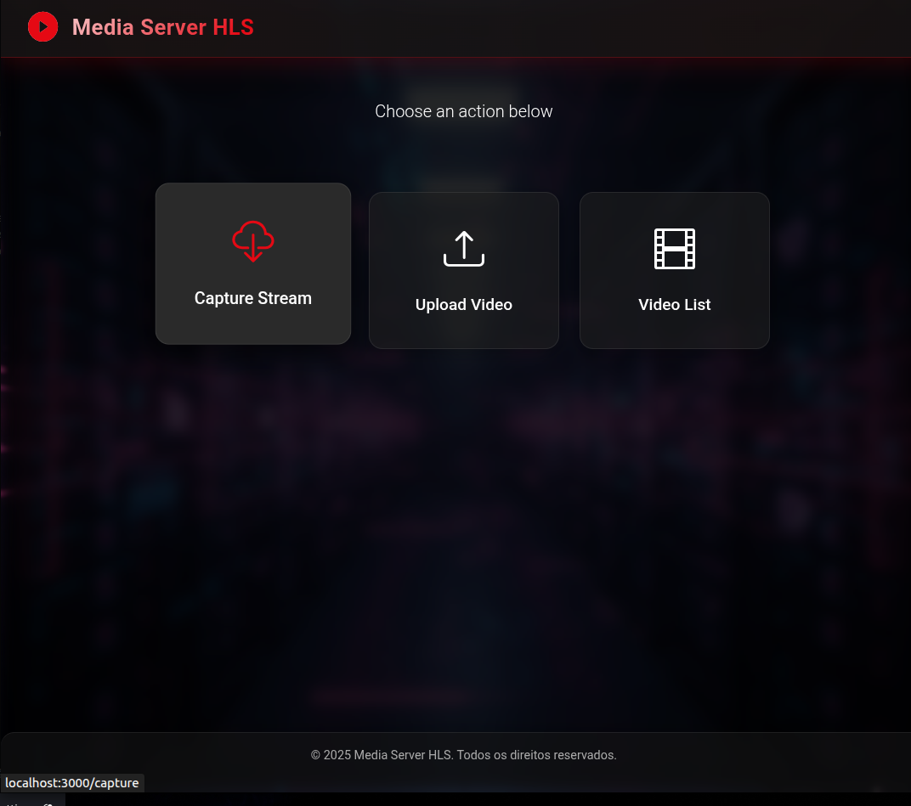
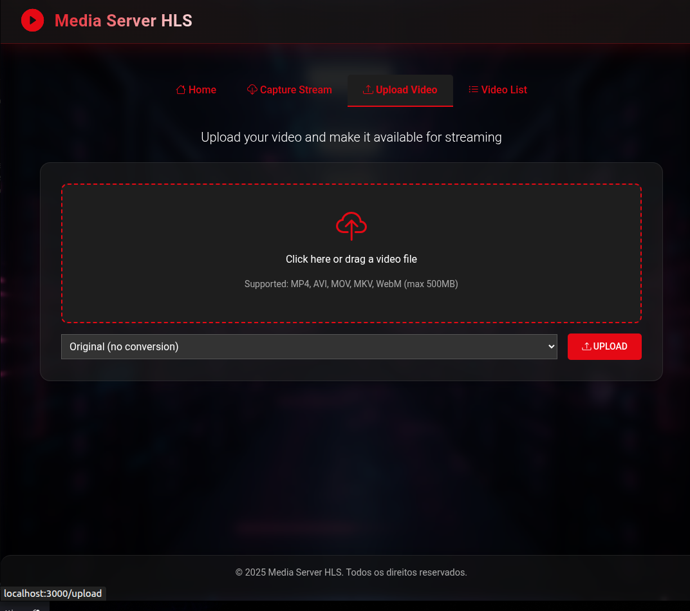
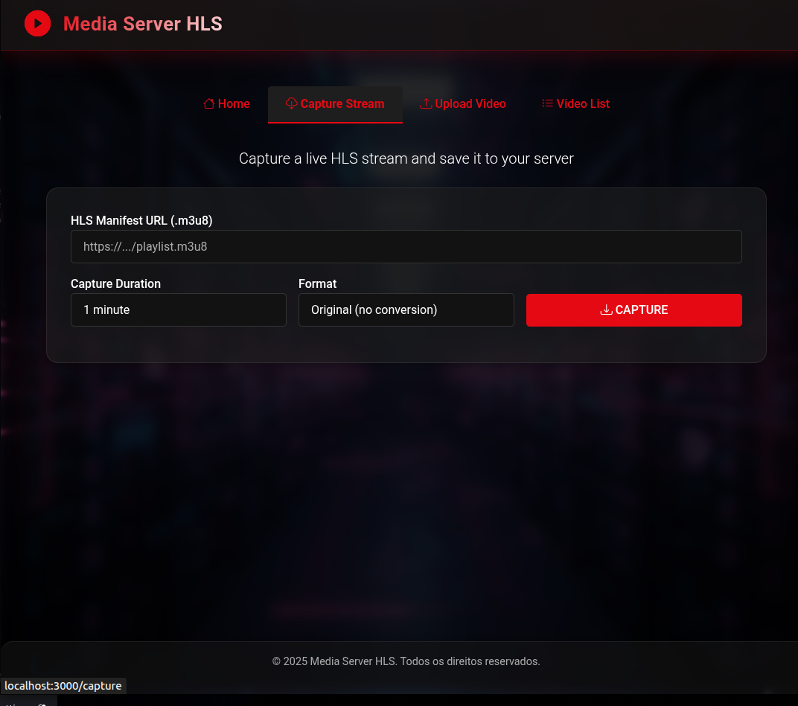
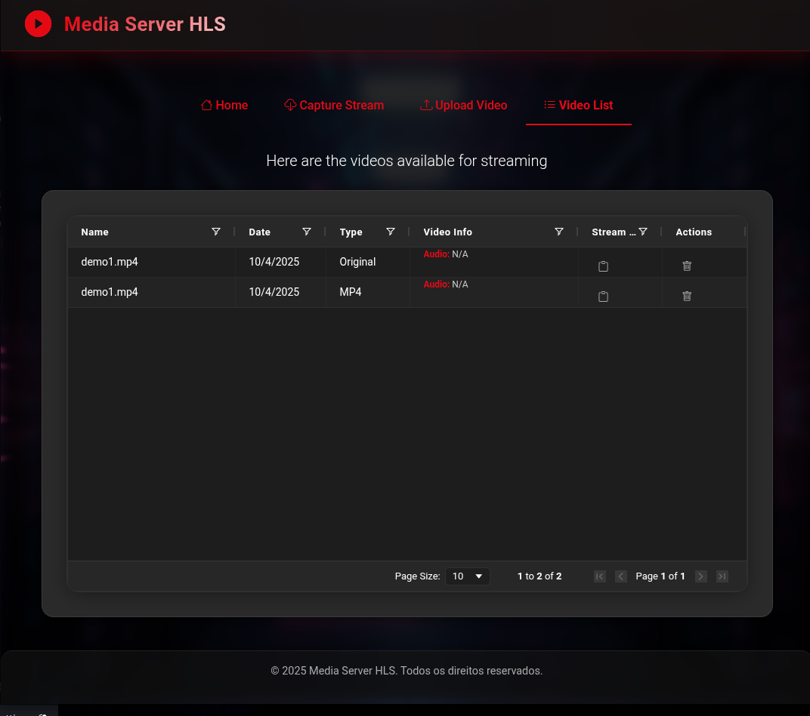

# Media Server HLS

A complete Node.js application for uploading, converting, and streaming videos in HLS (HTTP Live Streaming) format.

## About this project

This repository is an experiment/proof of concept to study how an HLS streaming server works, including upload, conversion, and video management. The main goal is to learn about encoders, processing flow, and the structure of a media server.

> **Note:** I currently work professionally with streaming platforms and video players. This project is a personal experiment to deepen my understanding of the streaming pipeline, encoding, and delivery, beyond my daily work experience.

This project is not intended for production, but for learning and exploring concepts such as:
- Video upload and conversion
- HLS playlist (.m3u8) and segment generation
- Content ingest: inserting the video into the platform, ensuring file integrity and metadata consistency
  - Encoding: converting the video to multiple resolutions and codecs, optimizing for different devices
  - Metadata enrichment: adding detailed information to the video, manually or automatically
- APIs and integrations:
  - Video and metadata query API
  - Public interface for the player
- Delivery/Distribution:
  - Dynamic packaging with HLS protocol

## 🚀 Features

- ✅ Video upload via web interface
- ✅ Automatic conversion to HLS format using FFmpeg
- ✅ HTML5 player with HLS.js support
- ✅ Modern interface with Material-UI
- ✅ Drag & Drop for upload
- ✅ Optimized video streaming
- ✅ Support for multiple video formats

## � Screenshots

### Main Interface

*The main page showing the upload area and video list.*

### Video Upload

*Drag & drop interface for uploading videos.*

### Video Capture

Capture a live HLS stream

### Video List

*List of uploaded and converted videos with streaming URLs.*

## �📋 Prerequisites

### 1. Node.js
Make sure you have Node.js (version 14 or higher) installed:
```bash
node --version
npm --version
```

### 2. FFmpeg
FFmpeg is essential for converting videos to HLS (fMP4) in this project. The binary is automatically installed via the npm dependency `@ffmpeg-installer/ffmpeg` and used by the `fluent-ffmpeg` package.

You don't need to install FFmpeg manually, as the project should do this automatically via npm. However, if you prefer or need it for testing, you can install it globally using:

#### Ubuntu/Debian:
```bash
sudo apt update
sudo apt install ffmpeg
```

#### CentOS/RHEL/Fedora:
```bash
sudo dnf install ffmpeg
```

#### macOS (with Homebrew):
```bash
brew install ffmpeg
```

#### Windows:
1. Download from: https://ffmpeg.org/download.html
2. Extract and add the binary to your system PATH

> The project uses internally:
> ```js
> const ffmpeg = require("fluent-ffmpeg");
> const ffmpegInstaller = require("@ffmpeg-installer/ffmpeg");
> ffmpeg.setFfmpegPath(ffmpegInstaller.path);
> ```
> So, it does not depend on GStreamer for HLS fMP4 conversion.

### 3. Check FFmpeg installation
```bash
ffmpeg -version
```

## 🛠️ Installation

1. **Clone or download the project:**
```bash
# If using a Git repository
git clone <repository-url>
cd MediaServer
```

2. **Install dependencies:**
```bash
npm install
```

3. **Start the server:**
```bash
# Production mode
npm start

# Development mode (with nodemon)
npm run dev
```

4. **Access the application:**
Open your browser and go to: http://localhost:3000

## 📁 Project Structure

```
MediaServer/
├── app.js              # Main Express server
├── package.json        # Configurations and dependencies
├── README.md           # This file
├── uploads/            # Temporary upload folder
├── hls/                # HLS converted videos
├── public/             # Static files
│   └── styles.css      # Additional styles
└── views/              # EJS templates
    └── index.ejs       # Main interface
```

## 💻 How to Use

1. **Video Upload:**
   - Click the upload area or drag a file
   - Supported formats: MP4, AVI, MOV, WMV, FLV, WebM, MKV
   - Max size: 500MB

2. **Automatic Conversion:**
   - The video will be automatically converted to HLS
   - The process generates .m3u8 files and .ts segments

3. **Playback:**
   - Click "PLAY" on any video in the list
   - The player supports adaptive streaming
   - Works in all modern browsers

## ⚙️ Configuration

### Server Port
Change the port in `app.js` or use an environment variable:
```bash
PORT=8080 npm start
```

### Upload Limits
Edit in `app.js`:
```javascript
limits: {
  fileSize: 500 * 1024 * 1024 // 500MB
}
```

### HLS Settings
Adjust conversion parameters in `app.js`:
```javascript
const gstCommand = [
  // ... other parameters
  'target-duration=10',  // Segment duration
  'max-files=0'         // Keep all segments
];
```

## 🐛 Troubleshooting

### Error: "FFmpeg not found"
- Make sure FFmpeg is installed: `ffmpeg -version`
- On Linux: install with apt/dnf as shown above
- On Windows: add FFmpeg to your PATH

### Error: "Conversion failed"
- Check if the video file is not corrupted
- Try a different format (MP4 is the most reliable)
- Check the server logs in the terminal

### Player does not load video
- Check if the .m3u8 file was created in the `hls/` folder
- Try a different browser
- Check the browser console for errors

### Permission issues
```bash
# Linux/macOS
chmod -R 755 uploads/ hls/

# Or run as sudo if needed
sudo npm start
```

## 🔧 Development

### Available Scripts
```bash
npm start     # Start in production
npm run dev   # Start with nodemon (auto-reload)
```

### Data Structure
Videos are stored in memory. For production, consider using:
- Database (MongoDB, PostgreSQL)
- Cloud storage (AWS S3, Google Cloud)

## 📄 License

MIT License - see LICENSE file for details.

---
